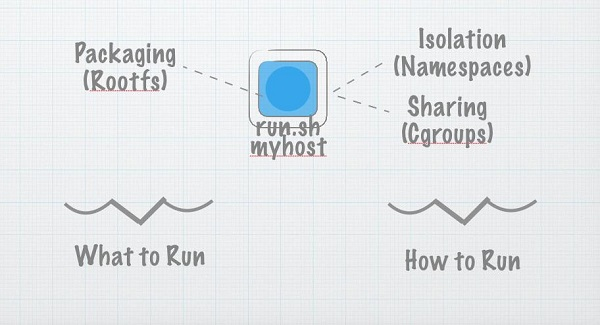

# 通过不到100行Go代码打造你自己的容器

- 中文: http://www.infoq.com/cn/articles/build-a-container-golang
- 英文: https://www.infoq.com/articles/build-a-container-golang

Docker在2013年三月实现了开源发布，它的出现让软件开发行业对于现代化应用的打包以及部署方式发生了巨大的变化。紧随着Docker的发布，各种具有竞争性、致敬性以及支持性的容器技术纷纷涌现，为这一领域带来了极大的关注度，同时也引起了人们的反思。这一系列文章将解答读者的各种困惑，对如何在企业中实际使用容器进行分析。

这一系列文章首先将对容器背后的核心技术进行观察，了解开发者目前如何使用容器，随后将分析在企业中部署容器的核心挑战，例如如何将容器技术与持续集成和持续交付管道进行集成，并对监控方式进行改进，以支持不断变化的负载，以及使用短期容器的潜在需求。本系列文章的总结部分将对容器技术的未来进行分析，并探讨无核化技术（unikernels）目前在处于技术前沿的组织中所扮演的角色。

本文是本系列文章“实际应用中的容器 —— 远离炒作”中的其中一篇。你可以通过RSS订阅该系列文章，以获取更新的通知。

----

比喻是一种很好的手段，但问题在于：当你听到某种比喻时，它会令你的大脑停止思考。有人说，软件架构设计“就像是”建筑的架构设计。不，他们其实并不一样。虽然这种比喻听起来很有帮助，但它事实上会造成更大的问题。与之类似，软件中的容器化技术经常被人形容为“就像”通过货运集装箱移动货物一样对软件进行移动的能力。这种比喻并不准确，或者说，这种比喻的意思虽然是正确的，但其中遗漏了大量的细节内容。

货运集装箱与软件容器确实有许多一致的部分。货运集装箱具有标准的形状与大小，它能够带来大规模与标准化的经济效益。而软件容器也能够带来诸多相同的益处，但这种比喻其实只停留在表面上，它只是一个目标，而并非既成事实。

为了准确地理解软件世界中的容器究竟是什么，我们首先要知道如何开发一个容器，这正是本文将要介绍的内容。在介绍过程中，我们将谈到容器与容器化技术、linux容器（包括命名空间、cgroups和分层文件系统），随后我们将通过一些代码从头开始创建一个简单的容器，最后，我们将谈到容器的真正意义。

## 容器究竟是什么？

我想先做个小游戏。现在请立即在你的脑海中告诉我“容器”是什么。好了吗？好，让我看看是否能够猜中你的回答：

你可能会提到以下内容中的一至数条：

- 一种共享资源的方式
- 进程隔离
- 类似于轻量级的虚拟化技术
- 将一个root文件系统与元数据封装在一起
- 类似于chroot jail
- 类似于货运集装箱的某种东西
- 就是Docker提供的功能

用一句话是难以表述容器的丰富含义的！“容器”这个单词也开始用于各种（有时会具有一些重叠性）概念，它既可用于对容器化技术的比喻，也可用于实现容器化的技术。如果我们能够分别思考这些概念，就能够得到一个更清晰的图景。因此，让我们首先来考虑一下为什么要使用容器，再讨论如何使用容器（之后，我们将再度回头讨论为什么它的原因）。

## 开始阶段

首先假设有一个程序，我们称之为run.sh。我们需要将这个程序拷贝至一个远程服务器并开始运行。不过，在远程服务器中随意运行代码是不安全的，并且这种方式难以进行管理及扩展。因此，我们投入了虚拟的私有服务器，并设置了用户权限。现在一切都运行良好。

但这个run.sh程序有一些依赖项。它需要在主机上存在某些特定的库，并且在远程与本地中的行为总是有些不同之处。因此我们使用了AMI（Amazon Machine 镜像）以及VMDK（VMware镜像）和Vagrantfiles等技术。现在一切都运行良好。

不过，它还是有一些不足之处。整个库已经很庞大了，并且由于这些技术并没有实现很高的标准化，因此很难高效地进行部署。因此，我们又开发了缓存功能。现在一切都运行良好。



缓存功能的存在使得Docker的镜像比VMDKs或Vagrantfiles高效得多，它使我们能够将相对于通用基础镜像的差异进行传递，而不是传递完整的镜像。这意味着我们能够将整个环境从一个位置转移至另一个位置。这也是为什么当你执行“docker run个某种程序”时，它能够以接近实时的速度启动，甚至是启动一个完整的操作系统镜像。我们稍后将深入讨论这种方式的工作机制细节。

这就是容器的功能，它能够将各种依赖包装在一起，使我们能够以一种可重复的、安全的方式部署代码。但这只是一种高层次的目标，而并非其定义。那么，让我们来讨论一些实际的东西吧。

## 创建一个容器

那么，究竟什么是容器呢（这次是认真的！）？如果创建一个容器能够像执行一个create_container系统调用一样简单就好了。它当然没这么简单，但其实也相差不远。

为了在低层次讨论容器，我们首先要讨论三个要素，这三个要素分别是命名空间、cgroups和分层文件系统。虽然还存在别的要素，但通过这三者就能够实现主体功能。

### 命名空间

命名空间提供了在一台机器中运行多个容器所必需的隔离性，同时使每个容器感觉就像在独立的环境中运行一样。在编写本文时，一共存在着6个命名空间。每个命名空间都可独立进行请求，相当于为一个进程（及其子进程）提供了这台机器的资源的某个子集的一个视图。

这些命名空间包括：

- PID：PID命名空间为某个进程及其子进程提供了系统中进程的一个子集的视图。你可以将其想象为一个映射表。当PID命名空间中的某个进程向kernel请求一个进程列表时，kernel将会检查这个映射表。如果该进程已经存在于表中，那么kernel就会返回其映射ID，而不是真实的ID。而如果该进程不存在于映射表中，那么kernel会假设该进程完全不存在。在PID命名空间中创建的第一个进程的pid为1（因此其主机ID的映射值为1），该命名空间在容器中会表现为一个隔离的进程树。
- MNT：在某种意义上说，mount命名空间是最重要的一个命名空间，它为其中所包含的进程提供了一个独有的mount表。这也意味着当这些进程对目录进行挂载或取消挂载时不会影响其他命名空间（包括主机命名空间）。更重要的是，我们将看到，通过与pivot_root这个系统调用的结合，它让某个进程能够拥有一个独有的文件系统。因此，只需交换容器的文件系统，进程就会认为它正运行在某个Ubuntu、BusyBox或Alpine中。
- NET：network命名空间为使用它的进程赋予了独立的网络栈。通常来说，只有在主network命名空间（也就是当机器启动时会自动启动的进程所在的命名空间）中才会被分配真实的物理网卡。但我们可以创建虚拟的网络设备对，即互联的网卡，其中一端属于某个network命名空间，而另一端则属于另一个network命名空间，通过这种方式在两个network命名空间之间创建了一个虚拟的连接。这种方式有些类似于在同一台主机中让多个IP栈进行通信。通过一定的路由逻辑，每个容器就能够保持自己独立的网络栈，同时能够与外界进行通信。
- UTS：UTS（UNIX Time-sharing System）命名空间为其中的进程提供了系统主机名与域名的独有视图。当进入某个UTS命名空间之后，对于主机名与域名的修改不会影响其他进程。
- IPC：IPC（Interprocess Communication）命名空间能够隔离各种进程间的通信机制，例如消息队列等等。可参考命名空间的相关文档，以了解更多细节。
- USER：user命名空间最近刚刚得到支持，从安全性的角度来看，它可能是最强大的一种命名空间了。user命名空间能够将某个进程所看到的uid映射为主机中一个不同的uid（以及gid）集合。这一特性非常实用，通过使用user命名空间，我们就能够将容器的root user ID（比如0）映射为主机中一个任意的（并且未赋予特权的）uid。这就意味着我们可以让某个容器认为它具有对root的访问权，而同时又无需为其赋予任何root命名空间中的权限（我们甚至可以为其访问特定于容器的资源赋予类似于root的权限）。容器可随意以uid 0运行进程（这通常意味着该用户具备root权限），而kernel会在内部将该uid映射为某个未赋予特权的真实uid。大多数容器系统都不会将容器中的任何一个uid映射为调用命名空间中的uid 0，换句话说，在容器中不存在任何一个具有root权限的uid。


大多数容器技术都会将用户进程放置于以上所有命名空间中，随后初始化这些命名空间，以提供一个标准的环境。举例来说，它能够在容器的隔离network命名空间中创建一个网卡，使其能够连接至主机中的真实网络。

### CGroups

老实说，CGroups的内容足以专门用一篇文章进行描述（我将保留撰写一篇这方面文章的权利！）。我将在本文中非常简洁地描述这部分内容，一旦你理解了其中的概念，就可以在文档中直接找到绝大部分问题的答案。

本质上说，CGroups的作用是将一系列进程或任务id集中在一起，为其设置各种限制。命名空间的作用是对进程进行隔离，而CGroups的目的是在进程中实施公平的（也可以是不公平的，这取决于你的想法，你可以随心所欲）资源共享。

kernel将CGroups暴露为一个特殊的文件系统，你可以进行挂载。只需将进程id添加至某个任务文件，就能够将进程或线程添加至某个CGroup中。之后，你只需编辑该目录中的文件，就能够对各种配置进行读取与修改。

### 分层文件系统

命名空间与CGroups负责容器化的隔离与资源共享，他们实现了容器的主体功能以及安全保障。而分层文件系统使我们能够高效地移动完整的机器镜像，它保证了容器的持续运作。

从本质上来看，分层文件系统的作用是使为每个容器创建一份root文件系统的拷贝的调用过程进行优化。有多种不同的方式可以实现这一目标。Btrfs在文件系统层使用了写时拷贝（copy-on-write）技术，而Aufs则使用了“union mounts”这种挂载机制。由于可以通过多种方式实现这一步骤，因此本文选择了一种非常简单的方式：我们将真正地创建一个拷贝。虽然这种方式很慢，但确实能够完成任务。

### 创建容器

**第一步：搭建程序的骨架**

我们首先来搭建这个程序的骨架。假设你已经安装了golang程序语言SDK的最新版本，那么请打开你的编辑器，并复制以下代码。

```go
package main

import (
    "fmt"
    "os"
    "os/exec"
    "syscall"
)

func main() {
    switch os.Args[1] {
    case "run":
        parent()
    case "child":
        child()
    default:
        panic("wat should I do")
    }
}

func parent() {
    cmd := exec.Command("/proc/self/exe", append([]string{"child"}, os.Args[2:]...)...)
    cmd.Stdin = os.Stdin
    cmd.Stdout = os.Stdout
    cmd.Stderr = os.Stderr

    if err := cmd.Run(); err != nil {
        fmt.Println("ERROR", err)
        os.Exit(1)
    }
}

func child() {
    cmd := exec.Command(os.Args[2], os.Args[3:]...)
    cmd.Stdin = os.Stdin
    cmd.Stdout = os.Stdout
    cmd.Stderr = os.Stderr

    if err := cmd.Run(); err != nil {
        fmt.Println("ERROR", err)
        os.Exit(1)
    }
}

func must(err error) {
    if err != nil {
        panic(err)
    }
}
```

那么这段程序的作用是什么呢？程序的入口是main.go，它需要读取第一个参数。如果该参数是‘run’，那么就运行parent()方法，如果是‘child’则运行child()方法。parent方法将执行‘/proc/self/exe’，这是一个特殊文件，它包含了当前可执行文件的一个内存镜像。换句话说，我们将重新调用这个程序本身，将‘child’作为第一个参数进行传递。

这种疯狂的做法有何意义？目前来说，确实没有太大作用。它只是让我们能够执行另一个程序，在其中执行一个由用户请求的程序（由‘os.Args[2:]’中的内容定义）。不过，基于这个简单的结构，我们就能够创建一个容器。

**第二步：添加命名空间**

为了在程序中加入命名空间，我们只需添加一行代码即可。在parent()方法的第二行添加以下代码，它的作用是让这个go程序在运行子进程时添加某些额外的标志。

```go
cmd.SysProcAttr = &syscall.SysProcAttr{
    Cloneflags: syscall.CLONE_NEWUTS | syscall.CLONE_NEWPID | syscall.CLONE_NEWNS,
}
```

如果你现在立即运行这段程序，就会发现该程序已经运行于UTS、PID以及MNT命名空间中了！

**第三步：root文件系统**

现在，你的进程已经运行在某些隔离的命名空间中了（请随意尝试在以上代码的Cloneflags中添加其他命名空间），但文件系统与主机看上去还是相同的。这是因为该进程运行在某个mount命名空间中，但原始的mount仍然是继承自负责创建工作的命名空间。

因此我们需要在这里进行一些改动。我们需要通过以下四行代码切换至root文件系统，请将这些代码放置在‘child()’函数的开头部分。

```go
must(syscall.Mount("rootfs", "rootfs", "", syscall.MS_BIND, ""))
    must(os.MkdirAll("rootfs/oldrootfs", 0700))
    must(syscall.PivotRoot("rootfs", "rootfs/oldrootfs"))
    must(os.Chdir("/"))
```

最后两行代码是最重要的部分，他们通知操作系统将‘/’所对应的当前目录改为‘rootfs/oldrootfs’，并将新的rootfs目录设置为‘/’。当‘pivotroot’调用 结束之后，容器中的‘/’目录将指向rootfs目录（绑定挂载的调用是为了满足‘pivotroot’命令的某些条件，操作系统要求通过‘pivotroot’所交换的文件系统不能处于同一棵树上，而通过将rootfs绑定挂载至其本身就能够完成这一目标，这种方式确实很愚蠢。）。

**第四步：初始化容器环境**

目前，你的进程已经运行在一系列隔离的命名空间中，并拥有了一个你所选择的root文件系统。我们可以跳过设置CGroups的部分，因为它非常简单。我们也省略了root文件系统管理的部分，它让你能够高效地下载及缓存我们刚刚通过‘pivotroot’方式创建的root文件系统镜像。

我们还省略了容器的配置部分，你现在所有的是一个运行在隔离的命名空间中的全新容器。我们通过切换至rootfs设置了mount命名空间，但其他命名空间仍然只有默认的内容。在实际的容器中，我们需要配置容器的整个环境，随后才能够运行用户进程。举例来说，我们需要设置网络、在运行进程前切换至正确的uid、并设置其他一些必要的限制（例如使用dropping的能力及设置rlimits）等等。这些工作可能会使我们的程序超过100行代码。

**第五步：汇总**

好了，我们已经有了一个超级简单的容器，它只用了（远远）不到100行的go代码。当然，我们有意简化了这一过程。如果你打算在生产环境中使用这个程序，你一定是疯了，请你自行承担后果吧。但我认为，通过这些简单而不那么正规的代码，能够帮助你了解具体发生了些什么。那么让我们来完整地看看这个程序吧。

```go
package main

import (
    "fmt"
    "os"
    "os/exec"
    "syscall"
)

func main() {
    switch os.Args[1] {
    case "run":
        parent()
    case "child":
        child()
    default:
        panic("wat should I do")
    }
}

func parent() {
    cmd := exec.Command("/proc/self/exe", append([]string{"child"}, os.Args[2:]...)...)
    cmd.SysProcAttr = &syscall.SysProcAttr{
        Cloneflags: syscall.CLONE_NEWUTS | syscall.CLONE_NEWPID | syscall.CLONE_NEWNS,
    }
    cmd.Stdin = os.Stdin
    cmd.Stdout = os.Stdout
    cmd.Stderr = os.Stderr

    if err := cmd.Run(); err != nil {
        fmt.Println("ERROR", err)
        os.Exit(1)
    }
}

func child() {
    must(syscall.Mount("rootfs", "rootfs", "", syscall.MS_BIND, ""))
    must(os.MkdirAll("rootfs/oldrootfs", 0700))
    must(syscall.PivotRoot("rootfs", "rootfs/oldrootfs"))
    must(os.Chdir("/"))

    cmd := exec.Command(os.Args[2], os.Args[3:]...)
    cmd.Stdin = os.Stdin
    cmd.Stdout = os.Stdout
    cmd.Stderr = os.Stderr

    if err := cmd.Run(); err != nil {
        fmt.Println("ERROR", err)
        os.Exit(1)
    }
}

func must(err error) {
    if err != nil {
        panic(err)
    }
}
```

## 那么，容器的意义究竟是什么？

以下的个人观点可能会引起一些争议：对我来说，容器是一种部署软件的美妙方式，它能够以开销非常低的方式运行代码，并实现极高的隔离性，但它的意义不仅仅体现在这里。容器是一种技术，而不是一种用户体验。

作为一个amazon.com网站上的买家，我不会特意打电话给码头去安排货物的配送过程。同理，作为用户来说，我也只是希望将容器部署至生产环境，而不必了解其具体细节。容器是一种用于构建系统的美妙技术，但我们不应该从打造一种优秀的开发者体验的角度出发，被容器能够高效部署机器镜像的能力所吸引。

许多平台即服务（PaaS）系统，例如Cloud Foundry所提供的用户体验基于代码，而不是基于容器。对于大多数开发者而言，他们的目标就是将代码上传后直接运行而已。Cloud Foundry及其他大多数PaaS平台都会在内部获取用户上传的代码，并创建一个容器化的镜像，这一过程可随意扩展及进行管理。Cloud Foundry通过buildpack实现这一功能，但你也可以忽略这一步骤，而直接上传一个从Dockerfile创建的Docker镜像。

在PaaS平台中仍然能够展现出容器的所有优势，包括一致的环境、高效的资源管理等等，但通过对用户体验的控制，PaaS平台既可为开发者提供一种简化的用户体验，也可提供一些额外的功能，例如在root文件系统出现安全隐患时自动为其打补丁。此外，这些平台还提供了数据库以及消息队列等服务，你可以将这些服务应用在你的app中，而无需从容器的角度考虑每种功能。

那么，我们已经对于容器的本质进行了充分的研究。现在，我们该怎样使用它们呢？

----

## 关于作者

Julian Friedman在IBM担任工程团队的主管，负责Cloud Foundry的容器技术Garden的研发。在参加Cloud Foundry的研发工作之前，Julian曾参与众多新型技术项目的研发工作。包括IBM Waton（它曾在危险边缘这个节目中进行测试）的性能优化工作，以及IBM Cloud技术的最初几个迭代。他最近刚刚获得了Map/Reduce领域的博士学位，因此，他打算如果可能的话，在余生都不再思考与Map/Reduce相关的东西了。他的twitter账号是 @doctor_julz。
